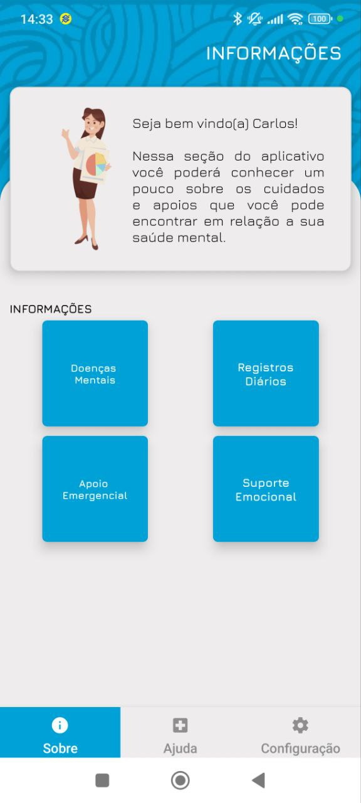
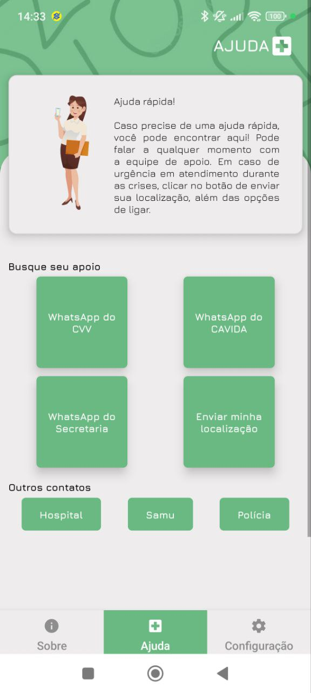
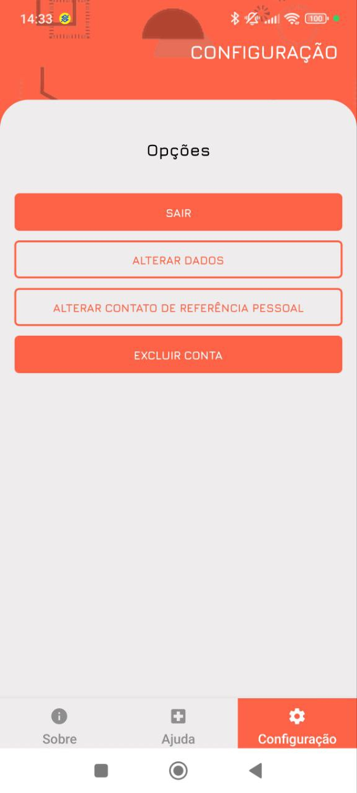

# Cuida Vida

Projeto de Mestrado da aluna Suzyanne

## Dados do projeto
- React Native
- Expo SDK 

## Instalação

Para usar o projeto basta baiaxar o repositório e instalar com o node:

```bash
git clone https://github.com/CarlosWGama/suzzy-saude-mental.git ./app
cd app
npm install
```

Também é necessário configurar o link para onde as requisições do backend deve ser enviado. Por isso copie o arquivo .env example e faça alterações caso necessário.

```bash
cp .env.example .env
```

## Rodando o projeto

No modo desenvolvimento, pode ser rodado com o comando:

```bash
npx expo start
```

Para gerar o build em produção pode ser feito com o comando eas

```bash
npm install -g eas-cli
eas build --profile production
```

ou localmente. No caso de Android:

```bash
cd android
./gradlew assembleRelease
```

## Telas do projeto

<table>
    <tr>
        <td></td>
        <td></td>
        <td></td>
    </tr>
</table>